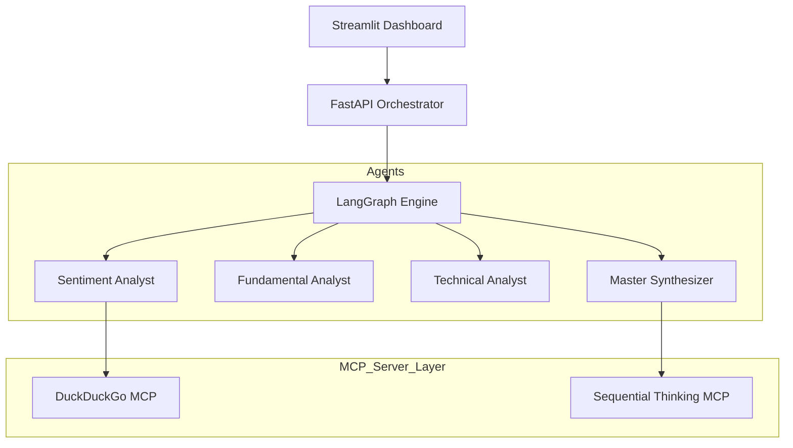

# 📈 Market Analyst AI - Multi-Agent Institutional Intelligence

Market Analyst AI is a sophisticated, institutional-grade financial analysis platform built using a **Multi-Agent Orchestration** framework (LangGraph) and the **Model Context Protocol (MCP)**. It provides deep fundamental, technical, and sentiment analysis for Indian and Global stocks, delivering professional reports with a premium dashboard interface.


## 🚀 Key Features

- **Multi-Agent Orchestration**: Specialized agents for Fundamental, Technical, and Sentiment analysis working in parallel via LangGraph.
- **MCP-First Architecture**: Standardized tool access using the Model Context Protocol:
    - **DuckDuckGo MCP**: Real-time market news and sentiment.
    - **Sequential Thinking MCP**: Advanced logic breakdown for complex portfolio synthesis.
- **Three Intelligent Modes**:
    1. **Market Analyst**: Deep dive into a single stock's health.
    2. **Stock Comparison**: Side-by-side technical and fundamental face-offs.
    3. **Portfolio Analysis**: Holistic risk and opportunity assessment for multiple holdings.
- **Premium Dashboard**: Real-time Plotly candlestick charts, scorecards (Fundamental/Technical/Sentiment), and structured "Buy/Hold/Sell" recommendations.
- **Institutional Reasoning**: Uses a dedicated logic layer to reduce hallucinations and provide data-backed insights.

## 🏗️ Architecture

The system follows a modern decoupled architecture:
- **Frontend**: Streamlit-based premium dashboard.
- **Backend**: FastAPI server managing the agentic graph logic.
- **Logic Layer**: LangGraph + MCP for standardized tool use and sequential reasoning.



## 🛠️ Tech Stack

- **LLMs**: Google Gemini (Master/Fundamental), Groq (Technical/Sentiment).
- **Frameworks**: LangChain, LangGraph, FastAPI, Streamlit.
- **Data Sources**: yfinance (Market Data), DuckDuckGo (News/Sentiment).
- **Protocol**: Model Context Protocol (MCP).

## 🚦 Getting Started

### 1. Prerequisites
- Python 3.9+
- Node.js & npx (for MCP servers)
- API Keys: Gemini & Groq

### 2. Local Setup
1. Clone the repository:
   ```bash
   git clone https://github.com/codeflex123/market_analyst.git
   cd market_analyst
   ```
2. Install dependencies:
   ```bash
   pip install -r requirements.txt
   ```
3. Set up environment variables (.env):
   ```env
   GEMINI_API_KEY_MASTER=your_key
   GROQ_API_KEY_TECHNICAL=your_key
   ...
   ```
4. Run the application:
   ```bash
   streamlit run streamlit_app.py
   ```

### 3. Cloud Deployment
This project is optimized for **Streamlit Cloud**:
1. Connect your GitHub repo to Streamlit Cloud.
2. Set `streamlit_app.py` as the main entry point.
3. Add your API keys to the **Secrets** manager in the Streamlit dashboard.

## 🛡️ Disclaimer
*Investment in the securities market is subject to market risks. Read all related documents carefully before investing. This AI tool provides analysis for educational purposes and should not be considered professional financial advice.*

---
Built with ❤️ by the Market Analyst AI Team.
