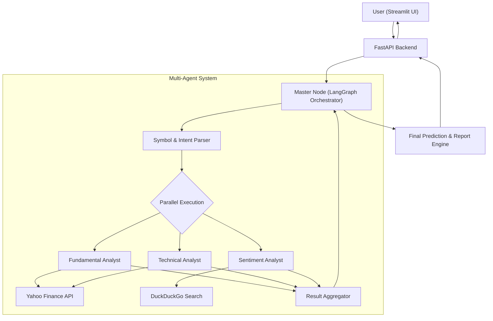

# Market Analyst Architecture

## Overview
Market Analyst is a multi-agent system designed to provide comprehensive Indian stock market insights. It leverages a team of AI agents specialized in fundamental, technical, and sentiment analysis to provide data-driven investment predictions and portfolio tracking.

## Tech Stack
- **Orchestration**: LangGraph
- **LLM Strategy**: Multi-LLM provider setup (2 Groq, 2 Gemini)
- **Backend API**: FastAPI
- **Frontend UI**: Streamlit
- **Data Sources**:
    - **Market Data**: Yahoo Finance (`yfinance`)
    - **Web Search/Sentiment**: DuckDuckGo Search (`duckduckgo_search`)
- **Environment**: Python 3.10+

---

## System Architecture

---

## Agent Roles & Responsibilities

### 1. Fundamental Analyst
- **Data Source**: `yfinance` (Ticker info, Balance Sheet, Income Statement, Cash Flow).
- **Focus**: PE ratio, Earning growth, Revenue, Profit margin, Market cap, Debt level.
- **Output**: Valuation summary and financial health score.

### 2. Technical Analyst
- **Data Source**: `yfinance` (Historical OHLCV data).
- **Focus**: RSI, MACD, Moving Averages (50/200 DMA), Bollinger Bands.
- **Output**: Trend analysis (Bullish/Bearish/Neutral) and key support/resistance levels.

### 3. Sentiment Analyst
- **Data Source**: `duckduckgo_search` (News, Articles, Social Media snippets).
- **Focus**: Recent news impact, corporate announcements, market mood.
- **Output**: Sentiment score (Positive/Negative/Neutral) with key news summaries.

### 4. Master Node (The Brain)
- **Role**: Orchestrates the flow using LangGraph.
- **Logic**:
    1.  **Extract**: Identify stock tickers from the query using an LLM (e.g., "Tata Motors" -> `TATAMOTORS.NS`).
    2.  **Dispatch**: Trigger Fundamental, Technical, and Sentiment Analysts in **parallel** for each identified ticker.
    3.  **Compile**: Receive structured data (JSON) from all analysts.
    4.  **Synthesize**: Generate a final response tailored to the user's query type (Status, Portfolio, or Comparison).

---

## Handling Specific Queries

### Query 1: "How is Reliance doing?"
- **Flow**: Master Node -> Analysts (FA, TA, SA) for `RELIANCE.NS` -> Synthesis -> Final Report.

### Query 2: "How is my portfolio doing (Tata motors, M&M, Infosys)?"
- **Flow**: Master Node identifies list of tickers -> **Parallel execution** of analyst teams for *each* ticker -> Aggregation -> Portfolio health dashboard report.

### Query 3: "Compare Tata motors & Mahindra? and which should I buy currently?"
- **Flow**: Master Node -> Parallel analyst teams for both stocks -> **Comparison Node** (weights metrics like RSI, P/E, and News Sentiment) -> Recommendation Engine -> Final decision with "Why".

---

## LLM Configuration Matrix

| Agent | Provider | Model (Recommended) | Rationale |
| :--- | :--- | :--- | :--- |
| **Master Node** | **Gemini** | Gemini 1.5 Pro | Superior reasoning for orchestration and final synthesis. |
| **Fundamental Analyst** | **Gemini** | Gemini 1.5 Flash | High context window for analyzing financial reports/tables. |
| **Technical Analyst** | **Groq** | Llama 3 (70B) | Extremely fast inference for processing numeric signals. |
| **Sentiment Analyst** | **Groq** | Mixtral 8x7B | Fast processing of multiple news snippets and social data. |

---

## Infrastructure Requirements (Secrets)
- `GROQ_API_KEY_1` (Master/Sentiment - though usually one key works for multiple models, user specified 4 different keys)
- `GROQ_API_KEY_2`
- `GEMINI_API_KEY_1`
- `GEMINI_API_KEY_2`
*(Note: System will be designed to support unique keys per agent to manage rate limits/quotas)*

---

## Development Principles & Reliability

### 1. Mandatory Testing
Every component (nodes, tools, API endpoints) must have corresponding unit/integration tests located in the `/tests` directory.

### 2. Mock-First Testing Strategy
To preserve free-tier API quotas and ensure deterministic results:
- **No real API calls** (yFinance, DuckDuckGo, Groq, Gemini) are permitted during automated testing.
- Use `pytest` with `unittest.mock` or `pytest-mock` to simulate all external dependencies.

### 3. Execution Logging (`dump.log`)
A centralized logging system will capture all agent transitions, tool outputs, and LLM prompts/responses into a `dump.log` file for debugging and auditing.

---

## Phase-wise Implementation Plan
- Repository setup with FastAPI.
- Implementation of YFinance and DuckDuckGo search tools.
- Minimal LangGraph state definition for a single ticker.

### Phase 2: Orchestration (Multi-Agent Brain)
- Implement parallel node execution for analysts.
- Build the Master Node logic for symbol extraction and intent detection.
- Integrate LLM for report synthesis.

### Phase 3: Advanced Features (Comparisons & Portfolio)
- Multi-ticker support in LangGraph state.
- Weighted scoring system for the "Buy/Sell" recommendation engine.
- Portfolio summary logic.

### Phase 6: Deep Polish & Reliability
- **Robust Symbol Mapping**: Enhanced NLP to map common names (e.g., "Kotak", "Tata") to official NSE tickers.
- **High-Fidelity Reports**: "Senior Strategist" AI persona for detailed, structured Markdown research notes with a strict "Recommendation -> Reasoning -> Three Sub-Reports" format (Fundamental, Technical, Sentiment).
- **Mandatory Metrics per Section**: Every sub-report (FA, TA, SA) must include the 6 key metrics (PE ratio, Earning growth, Revenue, Profit margin, Market cap, Debt level).
- **Live Candlestick Visualization**: Real-time Plotly charts using live historical data instead of mock values.
- **Cache Management UI**: Manual cache reset feature for force-refreshing data.

---

## Data Flow Example: "Compare Tata Motors & Mahindra"
1. **Master Node** identifies `TATAMOTORS.NS` and `M&M.NS`.
2. **Parallel Flow 1 (Tata Motors)**: FA, TA, SA run concurrently.
3. **Parallel Flow 2 (Mahindra)**: FA, TA, SA run concurrently.
4. **Aggregation**: Master node receives 6 reports.
5. **Synthesis**: Master node creates a side-by-side comparison table and provides a relative recommendation based on sector performance and current valuation.
