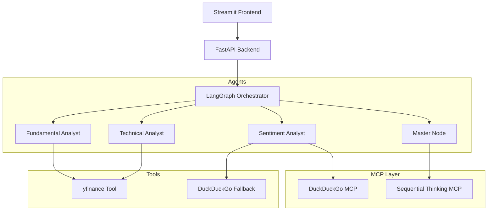

# 🏗️ Market Analyst - MCP Architecture

The project has transitioned to an **MCP-First Architecture**, leveraging the Model Context Protocol to standardize tool usage and enhance reasoning capabilities.

## High-Level Architecture

## Component Breakdown

### 1. LangGraph Orchestrator
Coordinates the flow between specialized agents. It handles parallel execution of technical and fundamental analysis.

### 2. MCP Layer (New)
Provides standardized access to powerful tools:
- **DuckDuckGo MCP**: Real-time news and market sentiment without API keys or credit cards.
- **Sequential Thinking MCP**: Advanced logic breakdown for the Master Node.

### 3. Analysts
- **Fundamental**: Analyzes P/E ratios, revenue growth, and debt.
- **Technical**: Prunes and summarizes price action (Last 5 days).
- **Sentiment**: Uses MCP tools to gauge market mood.

### 4. Master Node
Synthesizes all inputs into a cohesive investment report and a structured JSON object for the UI.

---
**Latest Update**: Migrated from legacy tools to MCP stdio-based clients.
